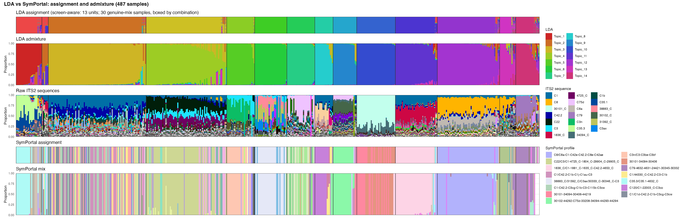
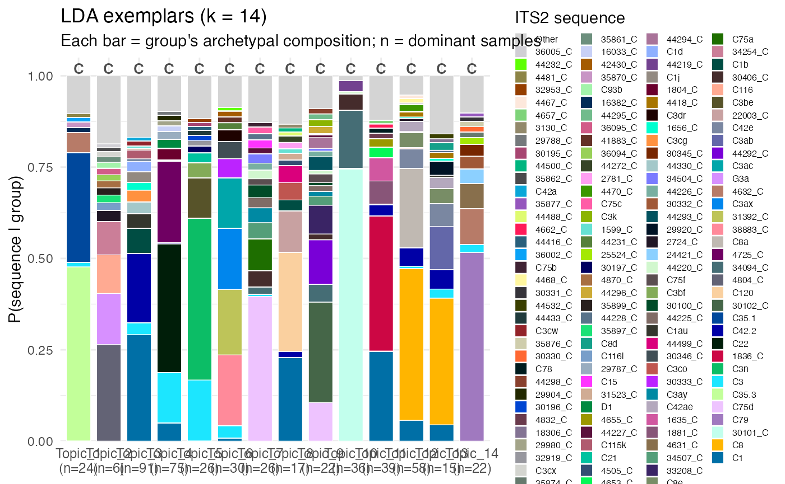
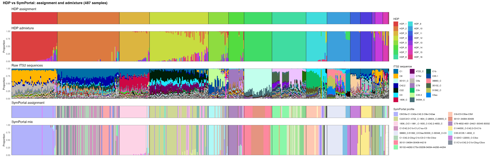
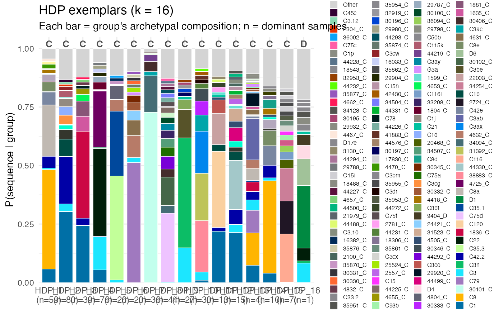

# 6. Example using Pocillopora

``` r


library(tidyverse)
library(ggplot2)
library(readxl)
library(kableExtra)
library(symbayes)


SP_PREFIX <- "8_eugenia_pocillidae_all_20231010T020451"
DATA_DIR  <- "~/symbayes/datasets/20231010T020451_pocill_all_uqserver/"

pd <- import(
  seqs_abund   = file.path(DATA_DIR, "post_med_seqs",
                           paste0(SP_PREFIX, ".seqs.absolute.abund_only.txt")),
  profs_abund  = file.path(DATA_DIR, "its2_type_profiles",
                           paste0(SP_PREFIX, ".profiles.absolute.abund_only.txt")),
  profs_meta   = file.path(DATA_DIR, "its2_type_profiles",
                           paste0(SP_PREFIX, ".profiles.meta_only.txt")),
  seqs_meta    = file.path(DATA_DIR, "post_med_seqs",
                           paste0(SP_PREFIX, ".seqs.absolute.meta_only.txt")),
  sample_sheet = file.path(DATA_DIR, "sample_sheet.xlsx"),
  colour_dict  = file.path(DATA_DIR, "html", "color_dict_post_med.json"),
  prof_colour_dict = file.path(DATA_DIR, "html", "prof_color_dict.json")
)

pd <- filter_samples(pd, min_reads = 100, min_prev = 2)

pd <- fit_dmm(pd) 
pd <- fit_hdp(pd)   
pd <- fit_lda(pd)

saveRDS(pd, "~/symbayes/datasets/pd.rds")
```

``` r
pd <- readRDS("~/symbayes/datasets/pd.rds")
```

### LDA

``` r

library(symbayes)

# screen = TRUE for intragenomics
plot_symportal_comparison(pd, model="lda", screen = TRUE)
#> Overdispersion test (LDA), real read counts: 19 pairs tested
#>   mixing (rho >= 0.05):        17
#>   ambiguous (0.01 < rho < 0.05): 1
#>   intragenomic (rho <= 0.01):  1
#>   rho = beta-binomial overdispersion (0 = fixed ratio; higher = mixing).
#>   psbA (single-copy) remains the definitive arbiter.
#> Topic pair comparison (LDA): 91 pairs
#>   redundant     0
#>   intragenomic  1
#>   mixing        17
#>   ambiguous     1
#>   distinct      72
#>   (psbA remains the definitive arbiter for intragenomic vs mixing)
#> 
#> Intragenomic screen (LDA):
#>   14 topics -> 13 suggested biological units (1 multi-topic groups)
#>   2 sample(s) deviate from their group's fixed ratio (flagged)
#>   Suggestion only; theta unchanged. Use merge_topics() to apply a grouping.
```



``` r

plot_exemplars(pd, model="lda")
```



using the symportal naming concept:

``` r

name_topics(pd, model = "lda") |> 
    kable(
    format = "html",
    digits = 2,
    ) |>
    kable_styling(full_width = FALSE)
```

|         | group    | name                              | clade | entropy | n_samples |
|:--------|:---------|:----------------------------------|:------|--------:|----------:|
| C35.3   | Topic_1  | C35.3/C35.1-4632_C                | C     |    2.49 |        24 |
| 4804_C  | Topic_2  | 4804_C/G3a-C116-34254_C           | C     |    4.35 |         6 |
| C1      | Topic_3  | C1/C42.2-C1b                      | C     |    4.18 |        91 |
| C22     | Topic_4  | C22/4725_C-C3                     | C     |    3.30 |        75 |
| C3n     | Topic_5  | C3n-C3-C3be                       | C     |    3.24 |        26 |
| 38883_C | Topic_6  | 38883_C/31392_C/C3ax/C3ac-30333_C | C     |    3.62 |        30 |
| C75d    | Topic_7  | C75d-C75a                         | C     |    3.89 |        26 |
| C120    | Topic_8  | C120/C1-22003_C                   | C     |    3.83 |        17 |
| 30102_C | Topic_9  | 30102_C-44292_C-C75d-33208_C      | C     |    4.06 |        22 |
| 30101_C | Topic_10 | 30101_C-34094_C                   | C     |    1.27 |        36 |
| 1836_C  | Topic_11 | 1836_C/C1-1635_C-1881_C           | C     |    3.25 |        39 |
| C8      | Topic_12 | C8/C8a-C1-C42e                    | C     |    3.05 |        58 |
| C81     | Topic_13 | C8-C3ab-C42e-C42.2                | C     |    4.09 |        15 |
| C79     | Topic_14 | C79-4632_C-4631_C                 | C     |    3.05 |        22 |

``` r

match_profiles(pd, model = "lda") |> 
    kable(
    format = "html",
    digits = 2,
    ) |>
    kable_styling(full_width = FALSE)
```

| group | topic_name | rank | sp_profile | cosine |
|:---|:---|---:|:---|---:|
| Topic_1 | C35.3/C35.1-4632_C | 1 | C35.3/C35.1-4632_C | 1.00 |
| Topic_1 | C35.3/C35.1-4632_C | 2 | C35.3/C35.1/C3ab-C8-C1-4632_C | 0.88 |
| Topic_1 | C35.3/C35.1-4632_C | 3 | C35.3/C35.1-4804_C-4632_C | 0.88 |
| Topic_2 | 4804_C/G3a-C116-34254_C | 1 | C35.3/C35.1-4804_C-4632_C | 0.38 |
| Topic_2 | 4804_C/G3a-C116-34254_C | 2 | 34254_C/1836_C-C1-C116 | 0.28 |
| Topic_2 | 4804_C/G3a-C116-34254_C | 3 | C1-C42.2-C1b-C1au | 0.18 |
| Topic_3 | C1/C42.2-C1b | 1 | C1/C42.2-C1b-C1j-C1au-C3 | 0.98 |
| Topic_3 | C1/C42.2-C1b | 2 | C1-C42.2-C3cg-C1b-C3-C115k-C3cw | 0.98 |
| Topic_3 | C1/C42.2-C1b | 3 | C1/C42.2-C1au-C1b-1656_C-C115k | 0.97 |
| Topic_4 | C22/4725_C-C3 | 1 | C22-4725-C3-C1-1804-29904 | 1.00 |
| Topic_4 | C22/4725_C-C3 | 2 | C22/C3/C1-4725_C-1804_C-29904_C-29905_C | 0.99 |
| Topic_4 | C22/4725_C-C3 | 3 | C22/C1-4725_C-C3-C42.2-C1b | 0.98 |
| Topic_5 | C3n-C3-C3be | 1 | C3n/C3-C3be-C3bf | 1.00 |
| Topic_5 | C3n-C3-C3be | 2 | C3n-C3 | 0.97 |
| Topic_5 | C3n-C3-C3be | 3 | C3-C22-4725-1804-C1 | 0.70 |
| Topic_6 | 38883_C/31392_C/C3ax/C3ac-30333_C | 1 | 38883_C/31392_C/C3ax/30333_C-30346_C-C3 | 0.91 |
| Topic_6 | 38883_C/31392_C/C3ax/C3ac-30333_C | 2 | C3ac-C3dr-C3ax-19217 | 0.49 |
| Topic_6 | 38883_C/31392_C/C3ax/C3ac-30333_C | 3 | C40 | 0.10 |
| Topic_7 | C75d-C75a | 1 | C75d-30406-34507-C3ay-30100-44225-34504-44220 | 0.98 |
| Topic_7 | C75d-C75a | 2 | C75d-30406-34507-30100-C3ay-44220 | 0.97 |
| Topic_7 | C75d-C75a | 3 | C75d-30406-30100 | 0.97 |
| Topic_8 | C120/C1-22003_C | 1 | C120/C1-22003_C-C3co | 0.98 |
| Topic_8 | C120/C1-22003_C | 2 | C42.2/C1-C1b-C3 | 0.55 |
| Topic_8 | C120/C1-22003_C | 3 | C1-C42.2-C3cg-C1b-C3-C115k-C3cw | 0.52 |
| Topic_9 | 30102_C-44292_C-C75d-33208_C | 1 | 30102-44292-C75d-33208-34094-44293-44294 | 1.00 |
| Topic_9 | 30102_C-44292_C-C75d-33208_C | 2 | C75d-30406-34507-C3ay-30100-44225-34504-44220 | 0.34 |
| Topic_9 | 30102_C-44292_C-C75d-33208_C | 3 | C75d-30406-34507-30100-C3ay-44220 | 0.33 |
| Topic_10 | 30101_C-34094_C | 1 | 30101-34094-30406-44219 | 1.00 |
| Topic_10 | 30101_C-34094_C | 2 | 30101-34094-30406 | 1.00 |
| Topic_10 | 30101_C-34094_C | 3 | 30102-44292-C75d-33208-34094-44293-44294 | 0.03 |
| Topic_11 | 1836_C/C1-1635_C-1881_C | 1 | 1836_C/C1-1881_C-1635_C-C42.2-4653_C | 1.00 |
| Topic_11 | 1836_C/C1-1635_C-1881_C | 2 | 1836-C1-1881-1635-C42.2 | 0.98 |
| Topic_11 | 1836_C/C1-1635_C-1881_C | 3 | 34254_C/1836_C-C1-C116 | 0.70 |
| Topic_12 | C8/C8a-C1-C42e | 1 | C8/C8a-C1-C42e-C42.2-C8e-C42ae | 1.00 |
| Topic_12 | C8/C8a-C1-C42e | 2 | C8-C8a-C1-C42.2-C8e-C42e | 0.98 |
| Topic_12 | C8/C8a-C1-C42e | 3 | C8/C42.2-C42e-C8e-C1 | 0.87 |
| Topic_13 | C8-C3ab-C42e-C42.2 | 1 | C8/C42.2-C42e-C8e-C1 | 0.94 |
| Topic_13 | C8-C3ab-C42e-C42.2 | 2 | C8-C8a-C1-C42.2-C8e-C42e | 0.84 |
| Topic_13 | C8-C3ab-C42e-C42.2 | 3 | C8/C8a-C1-C42e-C42.2-C8e-C42ae | 0.84 |
| Topic_14 | C79-4632_C-4631_C | 1 | C79-4632-4631-24421-30345-30332 | 1.00 |
| Topic_14 | C79-4632_C-4631_C | 2 | C79 | 0.98 |
| Topic_14 | C79-4632_C-4631_C | 3 | C79/C8-C8a | 0.91 |

``` r

compare_topics(pd, model = "lda")
#> Overdispersion test (LDA), real read counts: 19 pairs tested
#>   mixing (rho >= 0.05):        17
#>   ambiguous (0.01 < rho < 0.05): 1
#>   intragenomic (rho <= 0.01):  1
#>   rho = beta-binomial overdispersion (0 = fixed ratio; higher = mixing).
#>   psbA (single-copy) remains the definitive arbiter.
#> Topic pair comparison (LDA): 91 pairs
#>   redundant     0
#>   intragenomic  1
#>   mixing        17
#>   ambiguous     1
#>   distinct      72
#>   (psbA remains the definitive arbiter for intragenomic vs mixing)
```

``` r
scr <- screen_intragenomic(pd, "lda")
#> Overdispersion test (LDA), real read counts: 19 pairs tested
#>   mixing (rho >= 0.05):        17
#>   ambiguous (0.01 < rho < 0.05): 1
#>   intragenomic (rho <= 0.01):  1
#>   rho = beta-binomial overdispersion (0 = fixed ratio; higher = mixing).
#>   psbA (single-copy) remains the definitive arbiter.
#> Topic pair comparison (LDA): 91 pairs
#>   redundant     0
#>   intragenomic  1
#>   mixing        17
#>   ambiguous     1
#>   distinct      72
#>   (psbA remains the definitive arbiter for intragenomic vs mixing)
#> 
#> Intragenomic screen (LDA):
#>   14 topics -> 13 suggested biological units (1 multi-topic groups)
#>   2 sample(s) deviate from their group's fixed ratio (flagged)
#>   Suggestion only; theta unchanged. Use merge_topics() to apply a grouping.
scr$groups          # inspect first — see what it's proposing
#>    component group
#> 1    Topic_1     1
#> 2    Topic_2     1
#> 3    Topic_3     2
#> 4    Topic_4     3
#> 5    Topic_5     4
#> 6    Topic_6     5
#> 7    Topic_7     6
#> 8    Topic_8     7
#> 9    Topic_9     8
#> 10  Topic_10     9
#> 11  Topic_11    10
#> 12  Topic_12    11
#> 13  Topic_13    12
#> 14  Topic_14    13
```

### HDP

``` r

plot_symportal_comparison(pd, model="hdp")
```



``` r

plot_exemplars(pd, model="hdp")
```



using the symportal naming concept:

``` r

name_topics(pd, model = "hdp") |> 
    kable(
    format = "html",
    digits = 2,
    ) |>
    kable_styling(full_width = FALSE)
```

|  | group | name | clade | entropy | n_samples |
|:---|:---|:---|:---|---:|---:|
| C8 | HDP_1 | C8/C8a-C1-C42e-C42.2 | C | 2.94 | 59 |
| C1 | HDP_2 | C1/C42.2-C1b | C | 3.89 | 80 |
| 1836_C | HDP_3 | 1836_C/C1-1881_C-1635_C | C | 3.24 | 39 |
| C22 | HDP_4 | C22/4725_C-C3-C1 | C | 2.96 | 76 |
| C35.3 | HDP_5 | C35.3/C35.1-4804_C | C | 2.75 | 26 |
| C79 | HDP_6 | C79-4632_C-4631_C | C | 3.12 | 20 |
| 30101_C | HDP_7 | 30101_C-34094_C | C | 1.43 | 36 |
| C75d | HDP_8 | C75d-30102_C-44292_C | C | 4.36 | 44 |
| C3n | HDP_9 | C3n-C3-C3be | C | 3.12 | 27 |
| 38883_C | HDP_10 | 38883_C/31392_C/C3ax-C3ac-30333_C-30346_C | C | 3.55 | 30 |
| C120 | HDP_11 | C120/C1-22003_C-C3co | C | 3.44 | 13 |
| C11 | HDP_12 | C1/44330_C-C42.2-44499_C-31523_C | C | 4.16 | 15 |
| C3ab | HDP_13 | C3ab/C8/C79-C1-29920_C-C8a | C | 4.53 | 4 |
| C81 | HDP_14 | C8-C42e-C8e-C42.2 | C | 3.93 | 10 |
| C116 | HDP_15 | C116/2724_C/34254_C | C | 4.51 | 7 |
| D1 | HDP_16 | D1-D6-C3-D4-C22 | D | 4.58 | 1 |

``` r

match_profiles(pd, model = "hdp") |> 
    kable(
    format = "html",
    digits = 2,
    ) |>
    kable_styling(full_width = FALSE)
```

| group | topic_name | rank | sp_profile | cosine |
|:---|:---|---:|:---|---:|
| HDP_1 | C8/C8a-C1-C42e-C42.2 | 1 | C8/C8a-C1-C42e-C42.2-C8e-C42ae | 1.00 |
| HDP_1 | C8/C8a-C1-C42e-C42.2 | 2 | C8-C8a-C1-C42.2-C8e-C42e | 0.98 |
| HDP_1 | C8/C8a-C1-C42e-C42.2 | 3 | C8/C42.2-C42e-C8e-C1 | 0.87 |
| HDP_2 | C1/C42.2-C1b | 1 | C1-C42.2-C3cg-C1b-C3-C115k-C3cw | 0.98 |
| HDP_2 | C1/C42.2-C1b | 2 | C1/C42.2-C1b-C1j-C1au-C3 | 0.98 |
| HDP_2 | C1/C42.2-C1b | 3 | C1/C42.2-C1au-C1b-1656_C-C115k | 0.98 |
| HDP_3 | 1836_C/C1-1881_C-1635_C | 1 | 1836_C/C1-1881_C-1635_C-C42.2-4653_C | 1.00 |
| HDP_3 | 1836_C/C1-1881_C-1635_C | 2 | 1836-C1-1881-1635-C42.2 | 0.98 |
| HDP_3 | 1836_C/C1-1881_C-1635_C | 3 | 34254_C/1836_C-C1-C116 | 0.70 |
| HDP_4 | C22/4725_C-C3-C1 | 1 | C22-4725-C3-C1-1804-29904 | 1.00 |
| HDP_4 | C22/4725_C-C3-C1 | 2 | C22/C3/C1-4725_C-1804_C-29904_C-29905_C | 0.99 |
| HDP_4 | C22/4725_C-C3-C1 | 3 | C22/C1-4725_C-C3-C42.2-C1b | 0.98 |
| HDP_5 | C35.3/C35.1-4804_C | 1 | C35.3/C35.1-4632_C | 0.99 |
| HDP_5 | C35.3/C35.1-4804_C | 2 | C35.3/C35.1-4804_C-4632_C | 0.92 |
| HDP_5 | C35.3/C35.1-4804_C | 3 | C35.3/C35.1/C3ab-C8-C1-4632_C | 0.87 |
| HDP_6 | C79-4632_C-4631_C | 1 | C79-4632-4631-24421-30345-30332 | 1.00 |
| HDP_6 | C79-4632_C-4631_C | 2 | C79 | 0.98 |
| HDP_6 | C79-4632_C-4631_C | 3 | C79/C8-C8a | 0.91 |
| HDP_7 | 30101_C-34094_C | 1 | 30101-34094-30406-44219 | 1.00 |
| HDP_7 | 30101_C-34094_C | 2 | 30101-34094-30406 | 1.00 |
| HDP_7 | 30101_C-34094_C | 3 | 30102-44292-C75d-33208-34094-44293-44294 | 0.03 |
| HDP_8 | C75d-30102_C-44292_C | 1 | C75d-30406-34507-C3ay-30100-44225-34504-44220 | 0.90 |
| HDP_8 | C75d-30102_C-44292_C | 2 | C75d-30406-34507-30100-C3ay-44220 | 0.90 |
| HDP_8 | C75d-30102_C-44292_C | 3 | C75d-30406-30100 | 0.89 |
| HDP_9 | C3n-C3-C3be | 1 | C3n/C3-C3be-C3bf | 1.00 |
| HDP_9 | C3n-C3-C3be | 2 | C3n-C3 | 0.96 |
| HDP_9 | C3n-C3-C3be | 3 | C3-C22-4725-1804-C1 | 0.66 |
| HDP_10 | 38883_C/31392_C/C3ax-C3ac-30333_C-30346_C | 1 | 38883_C/31392_C/C3ax/30333_C-30346_C-C3 | 0.98 |
| HDP_10 | 38883_C/31392_C/C3ax-C3ac-30333_C-30346_C | 2 | C3ac-C3dr-C3ax-19217 | 0.29 |
| HDP_10 | 38883_C/31392_C/C3ax-C3ac-30333_C-30346_C | 3 | C40 | 0.10 |
| HDP_11 | C120/C1-22003_C-C3co | 1 | C120/C1-22003_C-C3co | 1.00 |
| HDP_11 | C120/C1-22003_C-C3co | 2 | C42.2/C1-C1b-C3 | 0.47 |
| HDP_11 | C120/C1-22003_C-C3co | 3 | C1-C42.2-C3cg-C1b-C3-C115k-C3cw | 0.46 |
| HDP_12 | C1/44330_C-C42.2-44499_C-31523_C | 1 | C1/44330_C-C42.2-C3-C1b | 0.99 |
| HDP_12 | C1/44330_C-C42.2-44499_C-31523_C | 2 | C42.2/C1-C1b-C3 | 0.67 |
| HDP_12 | C1/44330_C-C42.2-44499_C-31523_C | 3 | C1-C42.2-C3cg-C1b-C3-C115k-C3cw | 0.66 |
| HDP_13 | C3ab/C8/C79-C1-29920_C-C8a | 1 | C8/C1-C42.2-C8a-C42e | 0.90 |
| HDP_13 | C3ab/C8/C79-C1-29920_C-C8a | 2 | C8-C8a-C1-C42.2-C8e-C42e | 0.59 |
| HDP_13 | C3ab/C8/C79-C1-29920_C-C8a | 3 | C8/C8a-C1-C42e-C42.2-C8e-C42ae | 0.58 |
| HDP_14 | C8-C42e-C8e-C42.2 | 1 | C8/C42.2-C42e-C8e-C1 | 0.99 |
| HDP_14 | C8-C42e-C8e-C42.2 | 2 | C8-C8a-C1-C42.2-C8e-C42e | 0.88 |
| HDP_14 | C8-C42e-C8e-C42.2 | 3 | C8/C8a-C1-C42e-C42.2-C8e-C42ae | 0.88 |
| HDP_15 | C116/2724_C/34254_C | 1 | 2724 | 0.60 |
| HDP_15 | C116/2724_C/34254_C | 2 | 34254_C/1836_C-C1-C116 | 0.53 |
| HDP_15 | C116/2724_C/34254_C | 3 | C1-C42.2-C1b-C1au | 0.36 |
| HDP_16 | D1-D6-C3-D4-C22 | 1 | D1-D6-D4-9404-D17d | 0.98 |
| HDP_16 | D1-D6-C3-D4-C22 | 2 | C3-C22-4725-C1 | 0.44 |
| HDP_16 | D1-D6-C3-D4-C22 | 3 | C22/C3/C1-4725_C-1804_C-29904_C-29905_C | 0.29 |

``` r

compare_topics(pd, model = "hdp")
#> Overdispersion test (HDP), real read counts: 13 pairs tested
#>   mixing (rho >= 0.05):        10
#>   ambiguous (0.01 < rho < 0.05): 3
#>   intragenomic (rho <= 0.01):  0
#>   rho = beta-binomial overdispersion (0 = fixed ratio; higher = mixing).
#>   psbA (single-copy) remains the definitive arbiter.
#> Topic pair comparison (HDP): 120 pairs
#>   redundant     1
#>   intragenomic  2
#>   mixing        10
#>   ambiguous     4
#>   distinct      103
#>   (psbA remains the definitive arbiter for intragenomic vs mixing)
```

``` r
scr <- screen_intragenomic(pd, "hdp")
#> Overdispersion test (HDP), real read counts: 13 pairs tested
#>   mixing (rho >= 0.05):        10
#>   ambiguous (0.01 < rho < 0.05): 3
#>   intragenomic (rho <= 0.01):  0
#>   rho = beta-binomial overdispersion (0 = fixed ratio; higher = mixing).
#>   psbA (single-copy) remains the definitive arbiter.
#> Topic pair comparison (HDP): 120 pairs
#>   redundant     1
#>   intragenomic  2
#>   mixing        10
#>   ambiguous     4
#>   distinct      103
#>   (psbA remains the definitive arbiter for intragenomic vs mixing)
#> 
#> Intragenomic screen (HDP):
#>   16 topics -> 13 suggested biological units (2 multi-topic groups)
#>   3 sample(s) deviate from their group's fixed ratio (flagged)
#>   Suggestion only; theta unchanged. Use merge_topics() to apply a grouping.
scr$groups          # inspect first — see what it's proposing
#>    component group
#> 1      HDP_1     4
#> 2      HDP_2     1
#> 3      HDP_3    11
#> 4      HDP_4     2
#> 5      HDP_5     3
#> 6      HDP_6     4
#> 7      HDP_7     5
#> 8      HDP_8     6
#> 9      HDP_9     7
#> 10    HDP_10     8
#> 11    HDP_11     9
#> 12    HDP_12    10
#> 13    HDP_13    11
#> 14    HDP_14     4
#> 15    HDP_15    12
#> 16    HDP_16    13
```
