# 6. Example using Turbinaria

## 1. Import and filter

Import the key components from Symportal using `sp_import()` and bind to
a single object `spd`

``` r
library(tidyverse)
library(ggplot2)
library(readxl)
library(kableExtra)
library(symbayes)


DATA_DIR  <- "~/symbayes/datasets/20230120T102936_turb18_remote"
SP_PREFIX <- "241_20230127T162451_DBV_20230128T005644"  

spd <- import(
  seqs_abund   = file.path(DATA_DIR, "post_med_seqs",
                           paste0(SP_PREFIX, ".seqs.absolute.abund_only.txt")),
  profs_abund  = file.path(DATA_DIR, "its2_type_profiles",
                           paste0(SP_PREFIX, ".profiles.absolute.abund_only.txt")),
  profs_meta   = file.path(DATA_DIR, "its2_type_profiles",
                           paste0(SP_PREFIX, ".profiles.meta_only.txt")),
  seqs_meta    = file.path(DATA_DIR, "post_med_seqs",
                           paste0(SP_PREFIX, ".seqs.absolute.meta_only.txt")),
  sample_sheet = file.path(DATA_DIR, "sample_sheet.xlsx"),
  colour_dict  = file.path(DATA_DIR, "html", "color_dict_post_med.json")
)
```

then (if needed) filter sequences to a minimum number of reads
(`min_reads`), which acts identical to SymPortal’s 200-sequence cutoff.

``` r
spd <- filter_samples(spd, min_reads = 100, min_prev = 2)
```

### i) Fit DMM model:

Process: - Fits DMM for k = 1:max_k groups - Selects the number of
components by the Laplace approximation and BIC - Extracts posterior
membership, - Maps each sample’s dominant profile and clade.

``` r

spd <- fit_dmm(spd) 
```

### ii) Fit LDA model:

LDA answers **what each sample is made of**. Unlike DMM, membership is
*fractional*, so within-sample admixture is represented directly. This
vignette covers every LDA-specific function.

With `k = NULL` (the default),
[`fit_lda()`](https://marine-ecologist.github.io/symbayes/reference/fit_lda.md)
searches `k_range` and selects the **largest K with no redundant topic
pairs** (cosine `< redundant_thresh`). This resists the shadow topics
that perplexity-optimal K produces.

``` r
spd <- fit_lda(spd)
```

#### iii) fit HDP model:

Hierarchical Dirichlet processes (HDPs) extend the mixture-model
framework by allowing the number of latent components to be inferred
from the data rather than fixed in advance. Like LDA, HDPs allow samples
to have fractional membership across multiple latent community profiles,
but they are threshold-free in the sense that the model can adapt the
number of components as needed. This makes HDPs useful when both the
number of community types and the composition of each sample are
uncertain. In practice, HDPs can reveal fine-scale structure, but they
may also infer fewer or more components depending on how much shared
structure exists across samples.

Fit the hdp model:

``` r

spd <- fit_hdp(spd)             # flat, threshold-free
```

save models:

``` r

saveRDS(spd, "~/symbayes/datasets/spd.rds")
```

``` r

spd <- readRDS("~/symbayes/datasets/spd.rds")
```

## 2. Dirichlet-multinomial mixture model

DMMs treat each sample as belonging to one discrete community type. The
model assumes that samples are generated from one of K underlying
multinomial profiles, where each profile represents a characteristic
assemblage or community state. In this sense, DMMs are useful when the
goal is to classify samples into relatively clear groups, such as
dominant Symbiodiniaceae community types. Assignment is usually hard,
meaning each sample is allocated to a single best-fitting component,
although assignment uncertainty can still be examined. The number of
components, K, is typically selected by comparing models using criteria
such as the Laplace approximation.

[`fit_dmm()`](https://marine-ecologist.github.io/symbayes/reference/fit_dmm.md)
evaluates `k = 1:max_k` and selects K by the Laplace approximation to
the model evidence. Inspect the criteria:

``` r
dmm_plot_selection(spd)
```


``` r
spd$dmm$meta$model_fit     # the Laplace / AIC / BIC table
#>     K  Laplace      AIC      BIC
#> 1   1 21566.51 21864.44 22256.63
#> 2   2 20171.35 21152.03 21937.88
#> 3   3 19712.10 21421.32 22600.82
#> 4   4 19654.26 22003.70 23576.86
#> 5   5 19524.29 22599.95 24566.78
#> 6   6 19871.30 23531.40 25891.89
#> 7   7 20134.00 24382.39 27136.54
#> 8   8 20185.50 25203.44 28351.24
#> 9   9 20703.28 26134.21 29675.67
#> 10 10 20946.06 27093.76 31028.88
```

Visualising the dmm outputs:

### ii) Plot DMM model:

#### PCOA

``` r
plot_pcoa(spd, model = "dmm")
```

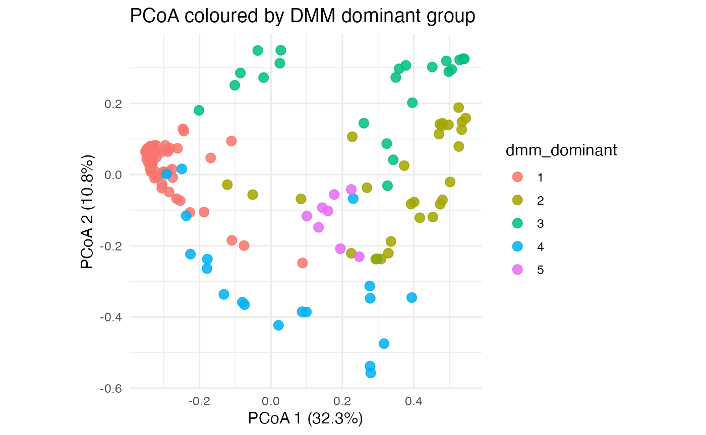 \###
Barplot

``` r
plot_barplot(spd, model = "dmm")
```

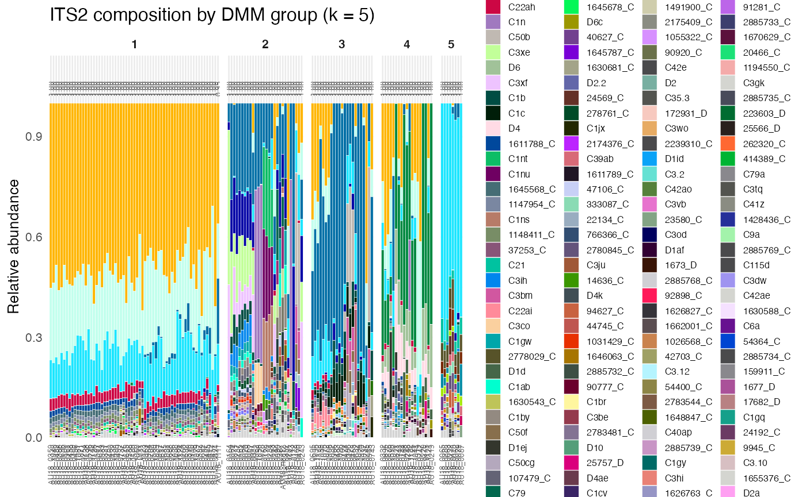 \###
Exemplars

``` r
plot_exemplars(spd, model = "dmm")
```

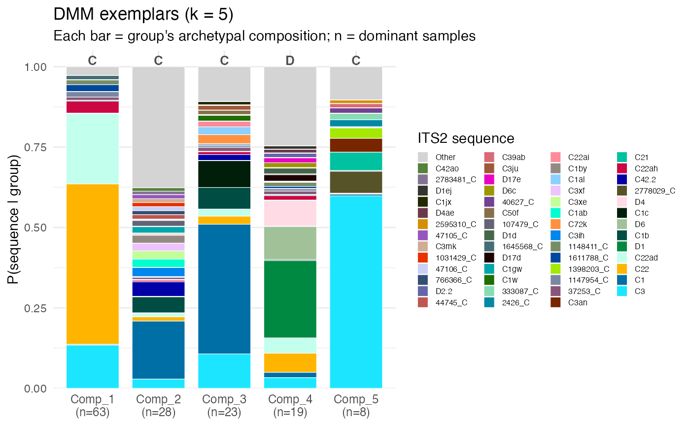 \###
Membership

``` r
plot_membership(spd, model = "dmm")
```

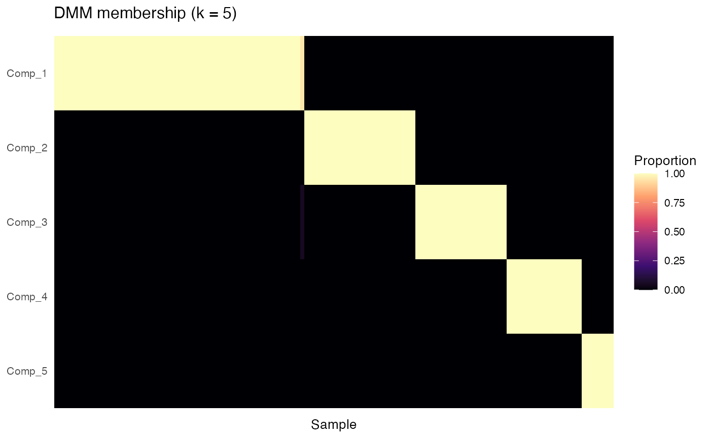 \###
Contingency

``` r
plot_contingency(spd, model = "dmm")
```

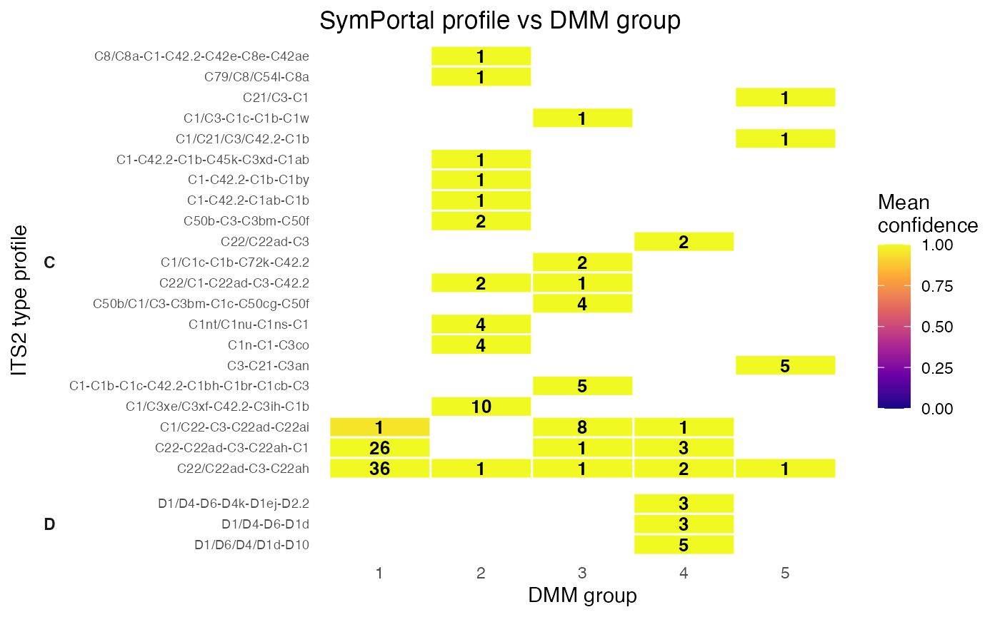 \### Top
Sequences

``` r
plot_top_seqs(spd, model = "dmm")
```

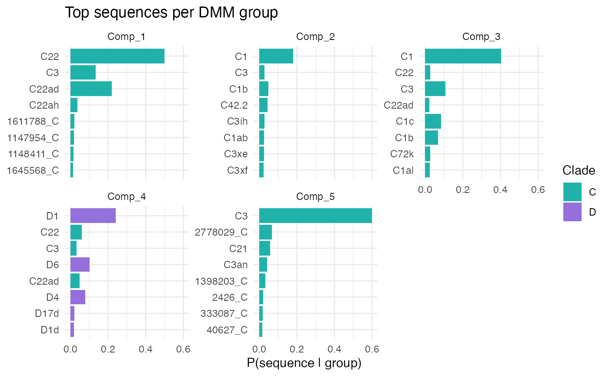

### Model selection with DMM

[`fit_dmm()`](https://marine-ecologist.github.io/symbayes/reference/fit_dmm.md)
evaluates `k = 1:max_k` and selects K by the Laplace approximation to
the model evidence. Inspect the criteria:

``` r
dmm_plot_selection(spd)
```

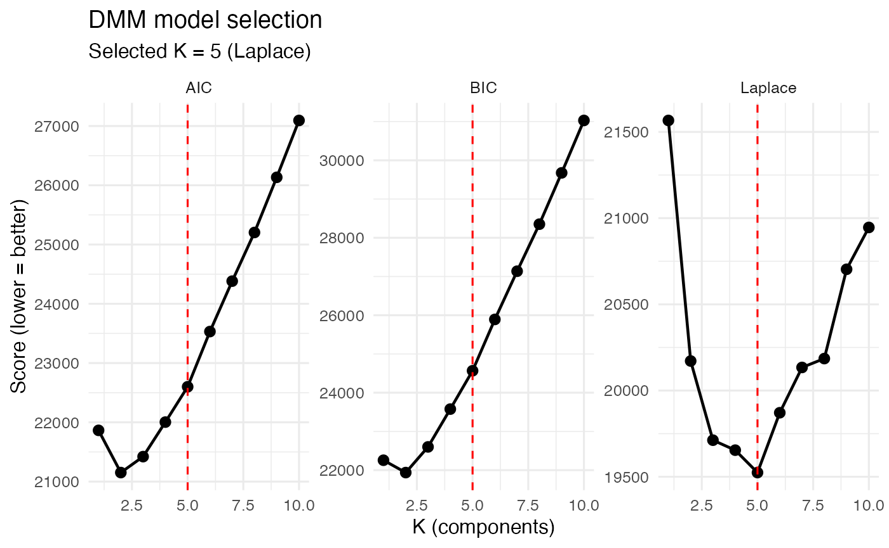

``` r
spd$dmm$meta$model_fit     # the Laplace / AIC / BIC table
#>     K  Laplace      AIC      BIC
#> 1   1 21566.51 21864.44 22256.63
#> 2   2 20171.35 21152.03 21937.88
#> 3   3 19712.10 21421.32 22600.82
#> 4   4 19654.26 22003.70 23576.86
#> 5   5 19524.29 22599.95 24566.78
#> 6   6 19871.30 23531.40 25891.89
#> 7   7 20134.00 24382.39 27136.54
#> 8   8 20185.50 25203.44 28351.24
#> 9   9 20703.28 26134.21 29675.67
#> 10 10 20946.06 27093.76 31028.88
```

### Assignment and certainty

The membership object holds the posterior and per-sample certainty:

``` r
spd$dmm$k                   # selected number of components
#> [1] 5
head(spd$dmm$theta)         # posterior membership (near one-hot)
#>        Comp_1       Comp_2       Comp_3       Comp_4       Comp_5
#> 158759      1 7.537624e-12 2.412294e-13 3.150114e-12 1.422421e-39
#> 158752      1 5.660563e-30 2.863315e-30 1.021696e-30 3.798470e-73
#> 158831      1 4.659364e-35 2.324003e-35 5.578593e-33 2.669320e-78
#> 158769      1 1.898072e-30 3.397402e-31 1.954633e-28 7.553626e-71
#> 158754      1 1.045678e-32 5.430072e-32 8.371002e-32 1.319867e-77
#> 158795      1 3.887298e-31 1.493003e-32 2.270293e-26 2.488716e-61
head(spd$dmm$meta$certainty)
#> 158759 158752 158831 158769 158754 158795 
#>      1      1      1      1      1      1
```

DMM certainty is typically near 1.0 even for mixed samples: this is a
property of the likelihood at amplicon read depths, not evidence of
unmixed communities. The tools below probe whether that confidence is
*stable*.

#### Diagnostics & Optimisation

#### Prediction on new samples

Score new count vectors against the fitted components with no refitting
(closed-form Dirichlet-Multinomial predictive):

``` r
# A hypothetical C22-dominated sample
model_seqs <- colnames(spd$count_mat)
x <- setNames(rep(0L, length(model_seqs)), model_seqs)
x[c("C22", "C3", "C1")] <- c(3000, 1500, 500)

predict_dmm(spd, x)
#>   sample assigned certainty total_reads     P_comp_1  P_comp_2  P_comp_3
#> 1  new_1        3 0.7609493        5000 3.289205e-41 0.2390507 0.7609493
#>       P_comp_4    P_comp_5
#> 1 1.810823e-15 5.48399e-34
```

#### Leave-one-out cross-validation

Refit on N-1 samples, predict the held-out one; reports concordance and
flags samples that switch component (candidate boundary/mixed samples):

``` r
loo <- dmm_loo(spd)
subset(loo, !concordant)
```

#### Subsample cross-validation

Faster alternative: repeatedly hold out a fraction and predict.

``` r
stab <- dmm_subsample_cv(spd, frac_test = 0.2, n_reps = 50)
head(stab)                 # least stable samples first
```

#### Simulation

Three modes probe DMM behaviour.

**Blend** two components across a gradient to trace the decision
boundary:

``` r
blend <- dmm_simulate(spd, mode = "blend", blend_comps = c(1, 2),
                      blend_range = seq(0, 1, 0.05))
```

**Perturb** real samples (reassign a fraction of reads) to test
robustness — a predictively-neutral perturbation that flips many
“certain” assignments demonstrates hard-assignment fragility:

``` r
perturb <- dmm_simulate(spd, mode = "perturb", perturb_frac = 0.10)
#> perturb accuracy: 43.0%
mean(perturb$assigned == perturb$true_comp)    # accuracy under 10% noise
#> [1] 0.43
```

**From alpha** draws from each component’s own Dirichlet — a
self-consistency check:

``` r
dmm_simulate(spd, mode = "from_alpha", n_sim = 200)
```

## 3. Latent Dirichlet allocation (LDA)

LDA treats each sample as a mixture of latent topics rather than
assigning it to a single community type. Each topic represents a
recurring community profile, and each sample is described by fractional
membership across those topics. This makes LDA useful when communities
are not cleanly separated, or when samples contain combinations of
multiple underlying assemblages. Instead of asking
`“which group does this sample belong to?”`, LDA asks
`“what is this sample made of?”`. The number of topics, K, is usually
chosen by fitting models across a range of values and selecting a
solution that balances interpretability, redundancy, and model fit.

4-panel K diagnostics

``` r
lda_plot_ksearch(spd)         
```

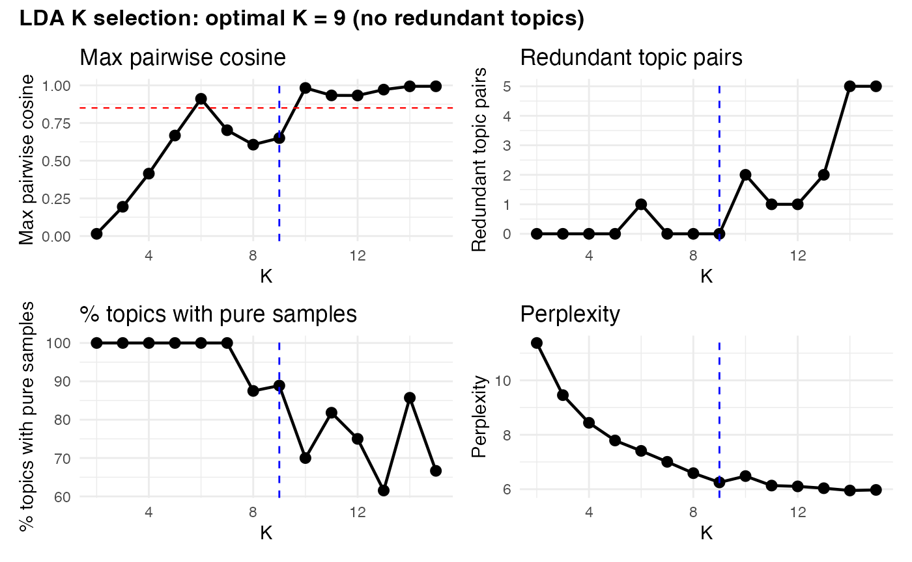

search table:

``` r
spd$lda$meta$selection         
#>     K max_cosine n_redundant n_pure_topics  pct_pure perplexity
#> 1   2 0.01468625           0             2 100.00000  11.373098
#> 2   3 0.19417445           0             3 100.00000   9.456049
#> 3   4 0.41427442           0             4 100.00000   8.439554
#> 4   5 0.66712812           0             5 100.00000   7.789258
#> 5   6 0.91081481           1             6 100.00000   7.407763
#> 6   7 0.70227372           0             7 100.00000   7.004775
#> 7   8 0.60640804           0             7  87.50000   6.588705
#> 8   9 0.65008741           0             8  88.88889   6.249001
#> 9  10 0.98260161           2             7  70.00000   6.481119
#> 10 11 0.93331084           1             9  81.81818   6.132651
#> 11 12 0.93278374           1             9  75.00000   6.103019
#> 12 13 0.97178441           2             8  61.53846   6.034959
#> 13 14 0.99345346           5            12  85.71429   5.951224
#> 14 15 0.99372736           5            10  66.66667   5.972582
```

Note: a topic is a recurring compositional pattern inferred from the
data.

In LDA & HDP, a topic is not a fixed observed group, but a probability
distribution over ITS2 profiles (i.e. a characteristic community
profile, defined by high probabilities for particular ITS2 sequences or
taxa).’

#### Admixtures

``` r
plot_admixtures(spd, model = "lda")
```

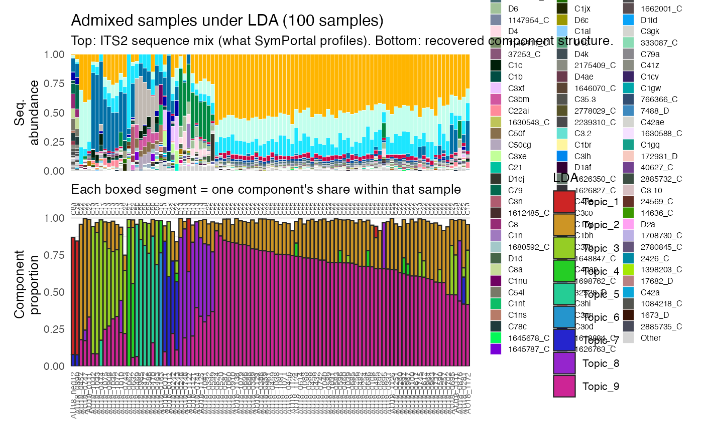

### Topic redundancy

Topic redundancy asks whether two inferred topics are actually
meaningfully different, or whether the model has split one
biological/community pattern into two near-duplicate topics. A
cosine-similarity matrix compares every topic against every other topic
based on their feature composition, where 0 = very different and 1 =
almost identical.

A pairwise similarity above about 0.85 suggests the topics may be
redundant. That is, the model may have used two topics to describe what
is effectively one community pattern. This is often called
over-splitting.

``` r
lda_plot_similarity(spd)
```

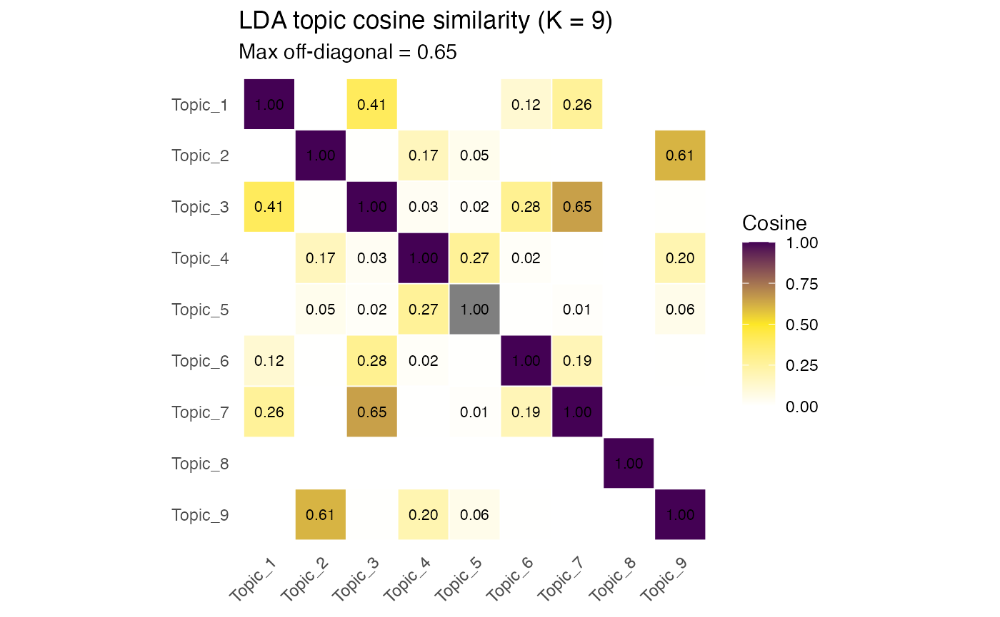

``` r
#spd$lda$meta$redundant         # flagged redundant pairs (should be empty)
```

### Fractional membership

Fractional membership means each sample is represented as a mixture of
topics rather than being assigned to only one topic.

Instead of saying:

`sample A belongs to topic 2`

LDA says something more like:

`sample A is 70% topic 2, 20% topic 5, and 10% topic 1`

These topic proportions sum to 1 for each sample. This is useful when
samples contain mixed communities, transitional states, or multiple
co-occurring assemblages.

The dominant topic is the topic with the largest proportion in a sample.
For example, if a sample is 80% topic 4, then topic 4 is its dominant
topic.

The maximum topic proportion describes how strongly a sample is
dominated by one topic. A value near 1 means the sample is nearly pure.
A lower value means the sample is more mixed.

The number of topics above 5% gives a simple count of how many topics
meaningfully contribute to a sample. If a sample has more than one topic
above 5%, it can be treated as a mixed sample.

The entropy summarises how evenly spread the sample is across topics.
Low entropy means one topic dominates. High entropy means the sample is
distributed across several topics. In ecological terms, entropy is a
compact measure of how mixed or compositionally ambiguous a sample is.

``` r
#spd$lda$k
#head(spd$lda$theta)            # rows sum to 1, values fractional
head(spd$metadata[, c("lda_dominant", "lda_entropy",
                     "lda_max_prop", "lda_n_topics")])
#>        lda_dominant lda_entropy lda_max_prop lda_n_topics
#> 158759            2   1.0055263    0.7789803            2
#> 158752            9   0.8246483    0.7783756            2
#> 158831            9   0.9240992    0.7154954            2
#> 158769            9   1.0035484    0.6740292            2
#> 158754            9   0.8160887    0.7814645            2
#> 158795            9   0.8311599    0.8201232            2
```

`lda_n_topics` counts topics above 5% per sample; `> 1` marks a mixed
sample. `lda_entropy` (bits) summarises mixing.

### Topic summary

[`lda_topic_summary()`](https://marine-ecologist.github.io/symbayes/reference/lda_topic_summary.md)
produces a report cross-referencing each topic to clade, host species,
SymPortal profiles, and its exemplar composition:

``` r
lda_topic_summary(spd, top_n = 9)
#> LDA topic exemplars (K = 9)
#> 
#> Topic 1 [Clade C] - 6 samples (entropy 0.52, purity 0.92)
#>   top profiles: C1n-C1-C3co:4, C79/C8/C54l-C8a:1, C8/C8a-C1-C42.2-C42e-C8e-C42ae:1
#>     C1n             [C] 52.0%
#>     C1              [C] 24.1%
#>     C3co            [C] 11.2%
#>     90777_C         [C] 2.2%
#>     2853_C          [C] 1.5%
#>     123623_C        [C] 1.5%
#>     92898_C         [C] 1.1%
#>     2885739_C       [C] 1.0%
#>     C1b             [C] 0.9%
#> 
#> Topic 2 [Clade C] - 4 samples (entropy 0.82, purity 0.79)
#>   top profiles: C22/C22ad-C3:2, C22/C22ad-C3-C22ah:2
#>     C22ad           [C] 55.1%
#>     C22             [C] 27.6%
#>     C3              [C] 10.9%
#>     37253_C         [C] 3.4%
#>     1670084_C       [C] 0.5%
#>     1622915_C       [C] 0.5%
#>     1646070_C       [C] 0.3%
#>     1148411_C       [C] 0.3%
#>     1646063_C       [C] 0.3%
#> 
#> Topic 3 [Clade C] - 16 samples (entropy 0.94, purity 0.76)
#>   top profiles: C1/C22-C3-C22ad-C22ai:7, C1-C1b-C1c-C42.2-C1bh-C1br-C1cb-C3:5, C1/C1c-C1b-C72k-C42.2:2
#>     C1              [C] 73.2%
#>     C1c             [C] 6.9%
#>     C1b             [C] 4.3%
#>     C22ai           [C] 3.5%
#>     C3              [C] 2.3%
#>     C42.2           [C] 1.6%
#>     C72k            [C] 1.5%
#>     C1al            [C] 1.1%
#>     C1w             [C] 0.9%
#> 
#> Topic 4 [Clade C] - 9 samples (entropy 0.66, purity 0.88)
#>   top profiles: C3-C21-C3an:5, C1/C21/C3/C42.2-C1b:1, C21/C3-C1:1
#>     C3              [C] 68.5%
#>     C21             [C] 5.3%
#>     2778029_C       [C] 4.0%
#>     C3n             [C] 3.3%
#>     C3an            [C] 2.0%
#>     40627_C         [C] 1.8%
#>     2426_C          [C] 1.5%
#>     1398203_C       [C] 1.5%
#>     333087_C        [C] 1.0%
#> 
#> Topic 5 [Clade C] - 6 samples (entropy 0.90, purity 0.79)
#>   top profiles: C50b/C1/C3-C3bm-C1c-C50cg-C50f:4, C50b-C3-C3bm-C50f:2
#>     C50b            [C] 41.4%
#>     C3              [C] 12.4%
#>     C3bm            [C] 11.3%
#>     C50f            [C] 7.2%
#>     C50cg           [C] 6.5%
#>     C1c             [C] 3.8%
#>     1645787_C       [C] 3.3%
#>     22134_C         [C] 2.2%
#>     1680592_C       [C] 1.5%
#> 
#> Topic 6 [Clade C] - 4 samples (entropy 0.46, purity 0.91)
#>   top profiles: C1nt/C1nu-C1ns-C1:4
#>     C1nu            [C] 25.9%
#>     C1nt            [C] 24.4%
#>     C1ns            [C] 21.0%
#>     C1              [C] 12.4%
#>     14636_C         [C] 4.2%
#>     1055322_C       [C] 2.8%
#>     C3ih            [C] 1.7%
#>     262320_C        [C] 1.3%
#>     C3hi            [C] 1.0%
#> 
#> Topic 7 [Clade C] - 15 samples (entropy 0.73, purity 0.85)
#>   top profiles: C1/C3xe/C3xf-C42.2-C3ih-C1b:10, C1-C42.2-C1ab-C1b:1, C1-C42.2-C1b-C1by:1
#>     C1              [C] 21.6%
#>     C3xe            [C] 16.6%
#>     C42.2           [C] 13.9%
#>     C3xf            [C] 11.4%
#>     C1b             [C] 4.5%
#>     C3ih            [C] 3.6%
#>     C1gw            [C] 3.5%
#>     107479_C        [C] 3.0%
#>     C1by            [C] 2.9%
#> 
#> Topic 8 [Clade D] - 14 samples (entropy 1.05, purity 0.71)
#>   top profiles: D1/D6/D4/D1d-D10:5, D1/D4-D6-D1d:3, D1/D4-D6-D4k-D1ej-D2.2:3
#>     D1              [D] 50.8%
#>     D6              [D] 13.5%
#>     D4              [D] 11.2%
#>     D1d             [D] 4.1%
#>     D1ej            [D] 3.9%
#>     D2.2            [D] 1.5%
#>     D6c             [D] 1.2%
#>     D10             [D] 1.2%
#>     D4k             [D] 1.0%
#> 
#> Topic 9 [Clade C] - 67 samples (entropy 1.07, purity 0.70)
#>   top profiles: C22/C22ad-C3-C22ah:34, C22-C22ad-C3-C22ah-C1:29, C1/C22-C3-C22ad-C22ai:3
#>     C22             [C] 61.0%
#>     C3              [C] 13.0%
#>     C22ad           [C] 10.9%
#>     C22ah           [C] 4.6%
#>     1611788_C       [C] 2.3%
#>     1645568_C       [C] 1.8%
#>     1147954_C       [C] 1.7%
#>     1148411_C       [C] 1.4%
#>     1630543_C       [C] 0.8%
```

### Interpreting exemplar overlap

Two topics sharing a sequence backbone are not necessarily redundant.
Use the cosine matrix (redundancy), per-sample `theta` (mixing), and
pure-sample counts together — a multi-coloured exemplar can reflect real
intragenomic variation within one community type rather than mixing. See

``` r
plot_exemplars(spd, model = "lda")
```

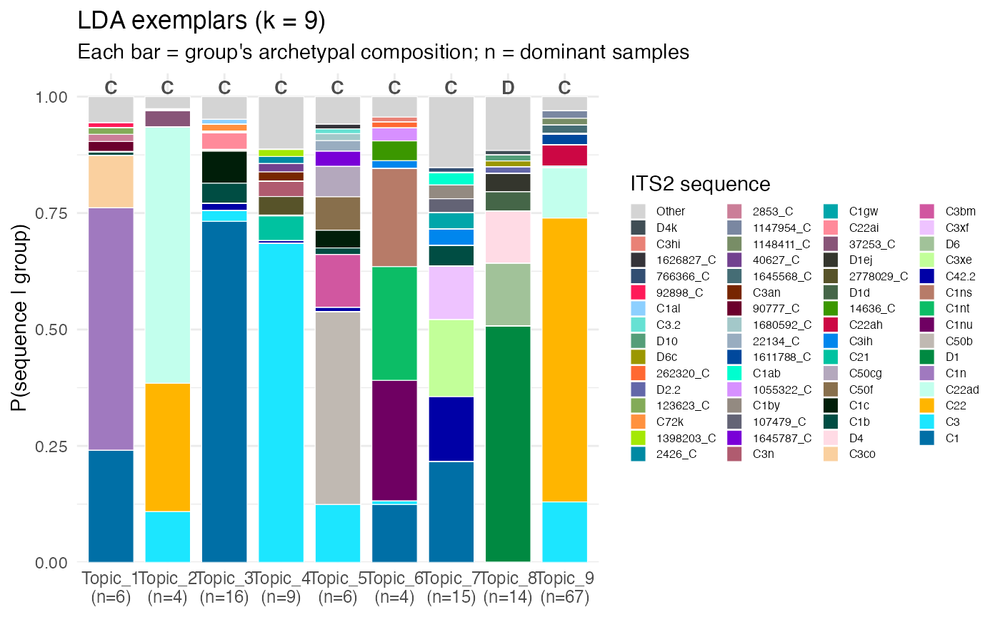

and

``` r
plot_membership(spd, model = "lda")
```

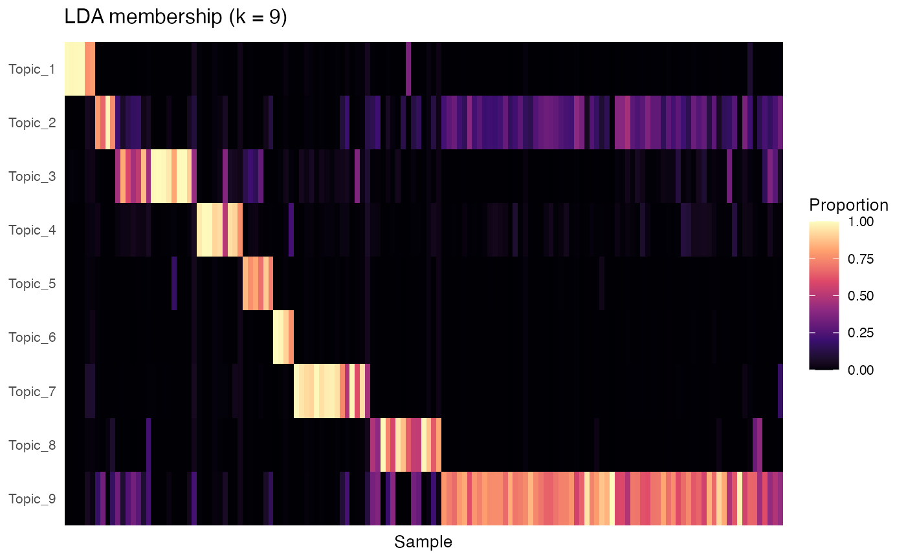

``` r


plot_barplot(spd, model = "lda")
```

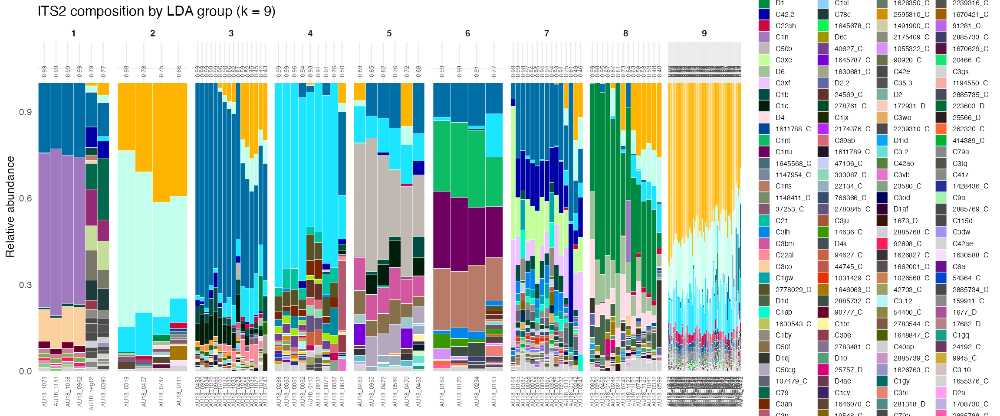

``` r


plot_admixtures(spd)
```

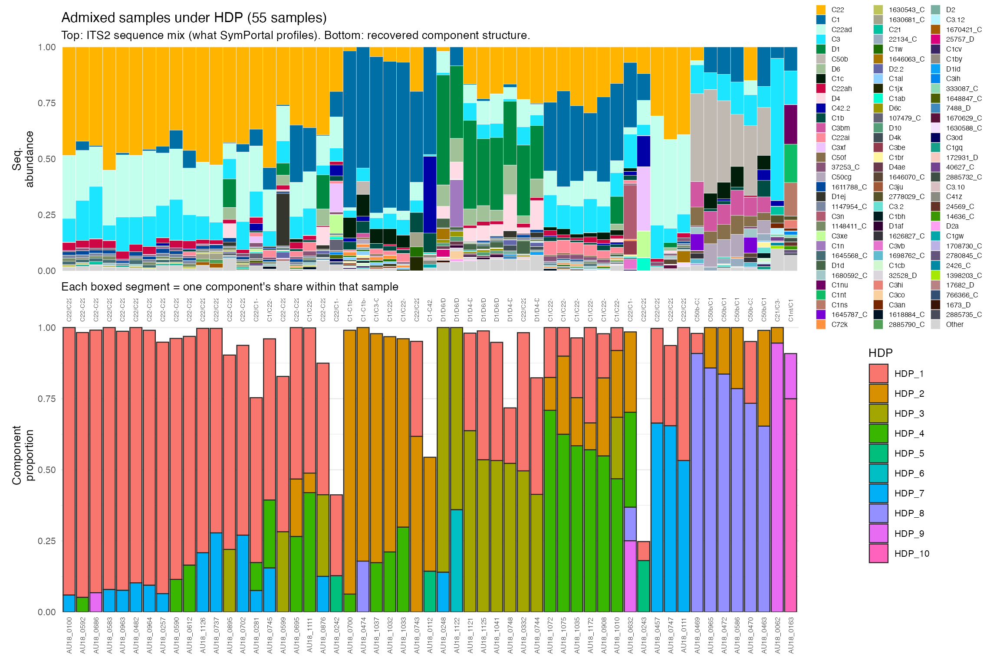

## 3. Hierarchical Dirichlet Process

The HDP is the threshold-free, mixture-aware core of `symbayes`. The
number of community types is **inferred from the data**, not specified,
and samples may be admixed. It requires the `hdp` package:

``` r
# devtools::install_github("NickWilliamsSanger/hdp", build_vignettes = FALSE)
```

In HDP, the model is fit by Gibbs sampling: rather than returning a
single answer, the sampler takes hundreds of draws from the posterior
distribution — each draw is one plausible clustering of the data given
the model and priors. The blue histogram shows, across those posterior
draws, how many raw clusters the sampler was using at each draw: it
ranged 13–17, median 14. That spread is the posterior over cluster
number — the model isn’t committing to one value, it’s expressing that
~14 clusters explains the data well, give or take. Crucially, these raw
clusters are per-draw and not aligned across draws: cluster 5 in draw
100 need not be cluster 5 in draw 200. So the raw count isn’t directly
usable as “the components.”

the
[`fit_hdp()`](https://marine-ecologist.github.io/symbayes/reference/fit_hdp.md)
funbction thentakes all the posterior draws, matches up clusters that
recur across them by cosine similarity (merging those above cos_merge =
0.90), and keeps only components that appear reproducibly across draws —
discarding transient clusters that flickered in and out of individual
draws without being stable features. The 14 raw → 10 extracted drop is
exactly this: four of the raw clusters weren’t reproducible enough (or
were near-duplicates merged into others), leaving 10 stable components.
“Inferred, not fixed” means the count came from the data’s posterior
rather than being specified, and “extracted” is the reproducible subset
of that posterior you can actually name and interpret. The red line at
10 sitting left of the blue mass is expected and correct — extraction is
meant to consolidate, not preserve the raw count.

``` r
hdp_plot_numcomp(spd)                # inferred number of components
#> Warning: Removed 2 rows containing missing values or values outside the scale range
#> (`geom_bar()`).
```

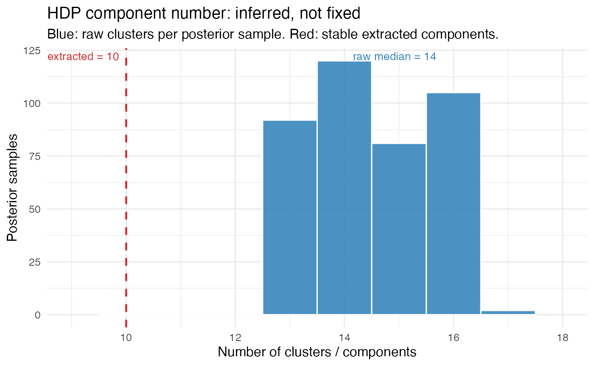

``` r
res <- hdp_vs_symportal(spd, over_split_min_frac = 0.7, mixture_thresh = 0.7)
#> SymPortal over-classification vs HDP
#>   SymPortal profiles: 34
#>   HDP components: 10
#>   Ratio: 3.4x
#> 
#>   Over-splitting (confident): 5 HDP components absorb >1 profile
#>     HDP_1 <- 2 profiles: C22/C22ad-C3-C22ah, C22-C22ad-C3-C22ah-C1
#>     HDP_2 <- 3 profiles: C1-C1b-C1c-C42.2-C1bh-C1br-C1cb-C3, C1/C1c-C1b-C72k-C42.2, C1/C3-C1c-C1b-C1w
#>     HDP_3 <- 2 profiles: D1/D6/D4/D1d-D10, D1/D4-D6-D1d
#>     HDP_8 <- 2 profiles: C50b/C1/C3-C3bm-C1c-C50cg-C50f, C50b-C3-C3bm-C50f
#>     HDP_9 <- 3 profiles: C3-C21-C3an, C21/C3-C1, C1/C21/C3/C42.2-C1b
#> 
#>   Mixture-as-taxa profiles (<70% one comp): 8
#>   Orphan profiles (excluded from over-split count): 0
```

Focus on the mixture profiles:

``` r
res$mixture_profiles           # profiles that are HDP admixtures
#>                            sp_profile n_samples dominant_hdp dominant_frac
#> 314241          C1/C22-C3-C22ad-C22ai        10            4    0.46729429
#> 313716          C22/C1-C22ad-C3-C42.2         3            1    0.28995773
#> 314184                C79/C8/C54l-C8a         1            1    0.04923822
#> 313731              C1-C42.2-C1ab-C1b         1            5    0.24997918
#> 313247 C8/C8a-C1-C42.2-C42e-C8e-C42ae         1            2    0.02271510
#> 314185    C1-C42.2-C1b-C45k-C3xd-C1ab         1            2    0.40068170
#> 313342              C1-C42.2-C1b-C1by         1            5    0.24993197
#> 314912         D1/D4-D6-D4k-D1ej-D2.2         3            3    0.54670293
#>        hdp_entropy is_mixture confident_assign
#> 314241   1.7429643       TRUE            FALSE
#> 313716   2.1556868       TRUE            FALSE
#> 314184   0.3923394       TRUE            FALSE
#> 313731   0.5007267       TRUE            FALSE
#> 313247   0.2648668       TRUE            FALSE
#> 314185   0.9310338       TRUE            FALSE
#> 313342   0.5023958       TRUE            FALSE
#> 314912   1.0820993       TRUE            FALSE
```

``` r
plot_barplot(spd, model="hdp")
```

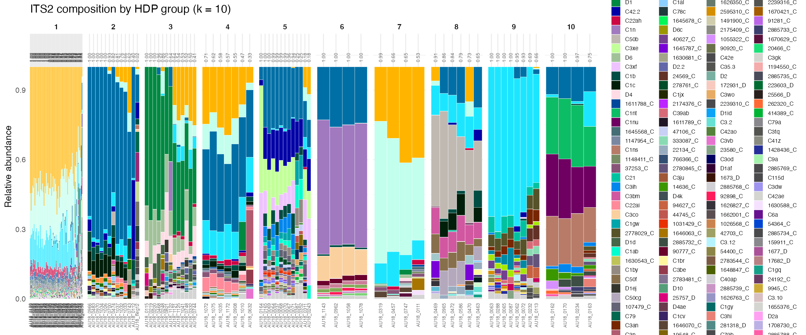

``` r

plot_exemplars(spd, model="hdp")
```

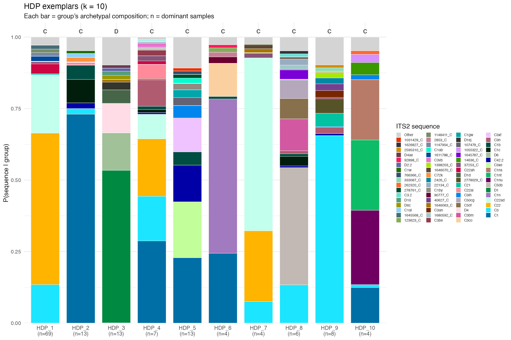

``` r
res <- hdp_vs_symportal(spd, over_split_min_frac = 0.7, mixture_thresh = 0.7)
#> SymPortal over-classification vs HDP
#>   SymPortal profiles: 34
#>   HDP components: 10
#>   Ratio: 3.4x
#> 
#>   Over-splitting (confident): 5 HDP components absorb >1 profile
#>     HDP_1 <- 2 profiles: C22/C22ad-C3-C22ah, C22-C22ad-C3-C22ah-C1
#>     HDP_2 <- 3 profiles: C1-C1b-C1c-C42.2-C1bh-C1br-C1cb-C3, C1/C1c-C1b-C72k-C42.2, C1/C3-C1c-C1b-C1w
#>     HDP_3 <- 2 profiles: D1/D6/D4/D1d-D10, D1/D4-D6-D1d
#>     HDP_8 <- 2 profiles: C50b/C1/C3-C3bm-C1c-C50cg-C50f, C50b-C3-C3bm-C50f
#>     HDP_9 <- 3 profiles: C3-C21-C3an, C21/C3-C1, C1/C21/C3/C42.2-C1b
#> 
#>   Mixture-as-taxa profiles (<70% one comp): 8
#>   Orphan profiles (excluded from over-split count): 0
```

``` r

plot_admixtures(spd, "hdp")
```

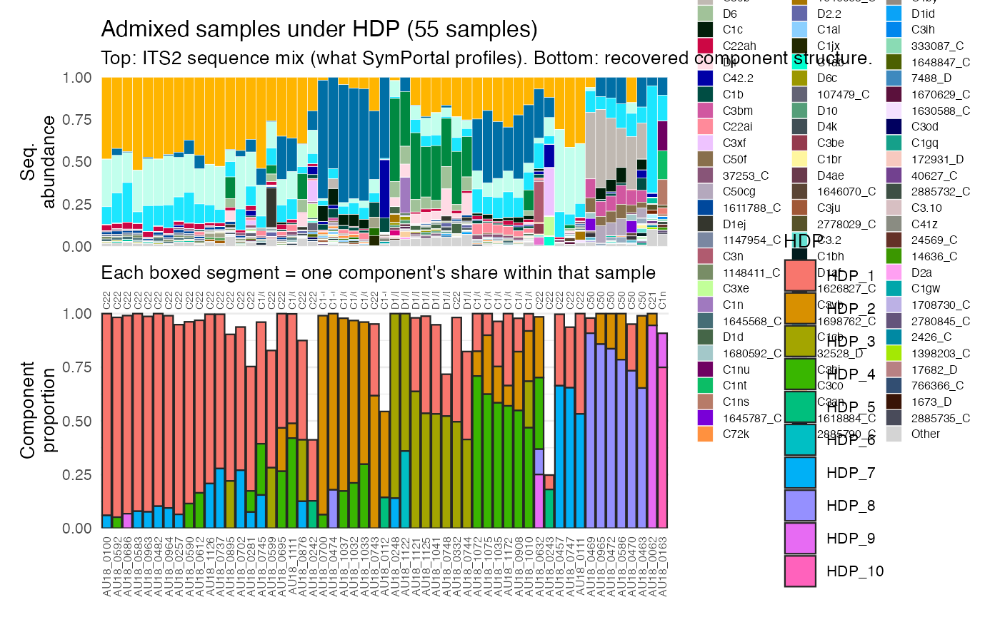

## 4. Compare fits

### 4a) LDA

#### lda v symportal

``` r

plot_symportal_comparison(spd, model="lda")
```

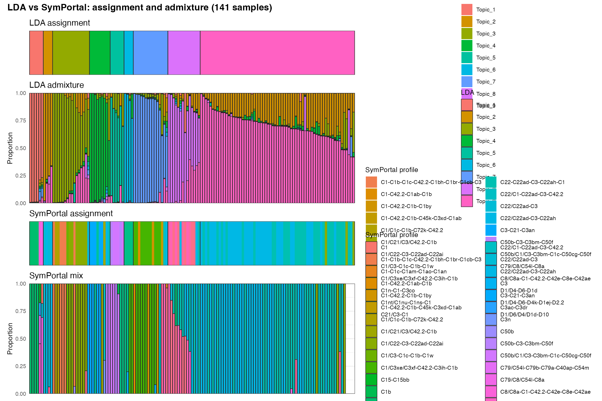

using the symportal naming concept:

``` r

name_topics(spd, model = "lda") |> 
    kable(
    format = "html",
    digits = 2,
    ) |>
    kable_styling(full_width = FALSE)
```

|       | group   | name                    | clade | entropy | n_samples |
|:------|:--------|:------------------------|:------|--------:|----------:|
| C1n   | Topic_1 | C1n-C1-C3co             | C     |    2.22 |         6 |
| C22ad | Topic_2 | C22ad/C22-C3            | C     |    1.77 |         4 |
| C1    | Topic_3 | C1-C1c                  | C     |    1.78 |        16 |
| C3    | Topic_4 | C3-C21                  | C     |    2.31 |         9 |
| C50b  | Topic_5 | C50b-C3-C3bm-C50f-C50cg | C     |    3.09 |         6 |
| C1nu  | Topic_6 | C1nu/C1nt/C1ns-C1       | C     |    2.84 |         4 |
| C11   | Topic_7 | C1/C3xe/C42.2/C3xf      | C     |    3.93 |        15 |
| D1    | Topic_8 | D1-D6-D4                | D     |    2.88 |        14 |
| C22   | Topic_9 | C22-C3-C22ad            | C     |    2.07 |        67 |

#### matching lda topics to symportal Majority ITS2 sequences

Cosine similarity measures the angle between two vectors, ignoring their
magnitude — it asks “do these point in the same direction?” not “are
they the same size?”

``` r

match_profiles(spd, model = "lda") |> 
    kable(
    format = "html",
    digits = 2,
    ) |>
    kable_styling(full_width = FALSE)
```

| group | topic_name | rank | sp_profile | cosine |
|:---|:---|---:|:---|---:|
| Topic_1 | C1n-C1-C3co | 1 | C1n-C1-C3co | 1.00 |
| Topic_1 | C1n-C1-C3co | 2 | C1/C1c-C1b-C72k-C42.2 | 0.41 |
| Topic_1 | C1n-C1-C3co | 3 | C1/C3-C1c-C1b-C1w | 0.41 |
| Topic_2 | C22ad/C22-C3 | 1 | C22/C22ad-C3 | 0.99 |
| Topic_2 | C22ad/C22-C3 | 2 | C22-C22ad-C3-C22ah-C1 | 0.78 |
| Topic_2 | C22ad/C22-C3 | 3 | C22/C22ad-C3-C22ah | 0.77 |
| Topic_3 | C1-C1c | 1 | C1/C1c-C1b-C72k-C42.2 | 1.00 |
| Topic_3 | C1-C1c | 2 | C1-C1b-C1c-C42.2-C1bh-C1br-C1cb-C3 | 1.00 |
| Topic_3 | C1-C1c | 3 | C1/C3-C1c-C1b-C1w | 1.00 |
| Topic_4 | C3-C21 | 1 | C3-C21-C3an | 1.00 |
| Topic_4 | C3-C21 | 2 | C21/C3-C1 | 0.99 |
| Topic_4 | C3-C21 | 3 | C1/C21/C3/C42.2-C1b | 0.99 |
| Topic_5 | C50b-C3-C3bm-C50f-C50cg | 1 | C50b-C3-C3bm-C50f | 0.94 |
| Topic_5 | C50b-C3-C3bm-C50f-C50cg | 2 | C50b/C1/C3-C3bm-C1c-C50cg-C50f | 0.92 |
| Topic_5 | C50b-C3-C3bm-C50f-C50cg | 3 | C21/C3-C1 | 0.27 |
| Topic_6 | C1nu/C1nt/C1ns-C1 | 1 | C1nt/C1nu-C1ns-C1 | 0.99 |
| Topic_6 | C1nu/C1nt/C1ns-C1 | 2 | C1/C3-C1c-C1b-C1w | 0.28 |
| Topic_6 | C1nu/C1nt/C1ns-C1 | 3 | C1/C1c-C1b-C72k-C42.2 | 0.28 |
| Topic_7 | C1/C3xe/C42.2/C3xf | 1 | C1/C3xe/C3xf-C42.2-C3ih-C1b | 1.00 |
| Topic_7 | C1/C3xe/C42.2/C3xf | 2 | C1-C42.2-C1b-C45k-C3xd-C1ab | 0.78 |
| Topic_7 | C1/C3xe/C42.2/C3xf | 3 | C1-C42.2-C1ab-C1b | 0.73 |
| Topic_8 | D1-D6-D4 | 1 | D1/D4-D6-D1d | 0.98 |
| Topic_8 | D1-D6-D4 | 2 | D1/D6/D4/D1d-D10 | 0.95 |
| Topic_8 | D1-D6-D4 | 3 | D1/D4-D6-D4k-D1ej-D2.2 | 0.88 |
| Topic_9 | C22-C3-C22ad | 1 | C22/C22ad-C3-C22ah | 0.97 |
| Topic_9 | C22-C3-C22ad | 2 | C22-C22ad-C3-C22ah-C1 | 0.97 |
| Topic_9 | C22-C3-C22ad | 3 | C22/C1-C22ad-C3-C42.2 | 0.74 |

### 4b) hdp v symportal

#### hdp v symportal

``` r
plot_symportal_comparison(spd, model="hdp")
```

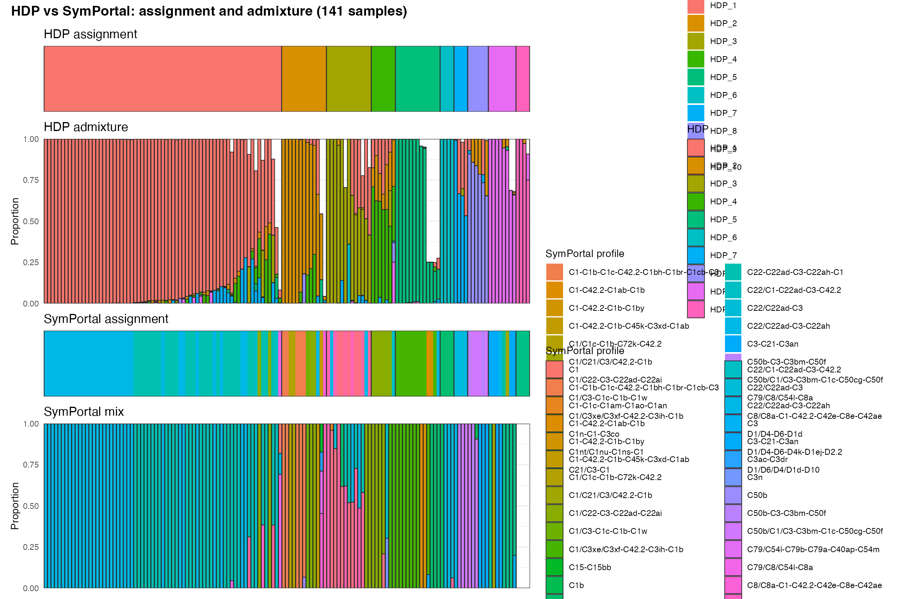

using the symportal naming concept:

``` r

name_topics(spd, model = "hdp") |> 
    kable(
    format = "html",
    digits = 2,
    ) |>
    kable_styling(full_width = FALSE)
```

|       | group  | name                    | clade | entropy | n_samples |
|:------|:-------|:------------------------|:------|--------:|----------:|
| C22   | HDP_1  | C22-C22ad-C3            | C     |    2.20 |        69 |
| C1    | HDP_2  | C1-C1c                  | C     |    1.76 |        13 |
| D1    | HDP_3  | D1-D6-D4                | D     |    2.77 |        13 |
| C11   | HDP_4  | C1/C22/C3-C3n-C22ad     | C     |    3.11 |         7 |
| C12   | HDP_5  | C1/C3xe/C42.2/C3xf      | C     |    3.70 |        13 |
| C1n   | HDP_6  | C1n-C1-C3co             | C     |    1.98 |         4 |
| C22ad | HDP_7  | C22ad-C22-C3            | C     |    1.75 |         4 |
| C50b  | HDP_8  | C50b-C3-C3bm-C50f-C50cg | C     |    3.12 |         6 |
| C3    | HDP_9  | C3-2778029_C            | C     |    2.49 |         8 |
| C1nu  | HDP_10 | C1nu/C1nt/C1ns-C1       | C     |    2.80 |         4 |

#### matching hdp topics to symportal Majority ITS2 sequences

Cosine similarity measures the angle between two vectors, ignoring their
magnitude — it asks “do these point in the same direction?” not “are
they the same size?”

``` r

match_profiles(spd, model = "hdp") |> 
    kable(
    format = "html",
    digits = 2,
    ) |>
    kable_styling(full_width = FALSE)
```

| group | topic_name | rank | sp_profile | cosine |
|:---|:---|---:|:---|---:|
| HDP_1 | C22-C22ad-C3 | 1 | C22/C22ad-C3-C22ah | 1.00 |
| HDP_1 | C22-C22ad-C3 | 2 | C22-C22ad-C3-C22ah-C1 | 1.00 |
| HDP_1 | C22-C22ad-C3 | 3 | C22/C22ad-C3 | 0.80 |
| HDP_2 | C1-C1c | 1 | C1/C1c-C1b-C72k-C42.2 | 1.00 |
| HDP_2 | C1-C1c | 2 | C1-C1b-C1c-C42.2-C1bh-C1br-C1cb-C3 | 1.00 |
| HDP_2 | C1-C1c | 3 | C1/C3-C1c-C1b-C1w | 1.00 |
| HDP_3 | D1-D6-D4 | 1 | D1/D4-D6-D1d | 0.99 |
| HDP_3 | D1-D6-D4 | 2 | D1/D6/D4/D1d-D10 | 0.96 |
| HDP_3 | D1-D6-D4 | 3 | D1/D4-D6-D4k-D1ej-D2.2 | 0.87 |
| HDP_4 | C1/C22/C3-C3n-C22ad | 1 | C1/C22-C3-C22ad-C22ai | 0.96 |
| HDP_4 | C1/C22/C3-C3n-C22ad | 2 | C22/C1-C22ad-C3-C42.2 | 0.92 |
| HDP_4 | C1/C22/C3-C3n-C22ad | 3 | C1/C3-C1c-C1b-C1w | 0.77 |
| HDP_5 | C1/C3xe/C42.2/C3xf | 1 | C1/C3xe/C3xf-C42.2-C3ih-C1b | 1.00 |
| HDP_5 | C1/C3xe/C42.2/C3xf | 2 | C1-C42.2-C1b-C45k-C3xd-C1ab | 0.74 |
| HDP_5 | C1/C3xe/C42.2/C3xf | 3 | C1-C42.2-C1ab-C1b | 0.68 |
| HDP_6 | C1n-C1-C3co | 1 | C1n-C1-C3co | 1.00 |
| HDP_6 | C1n-C1-C3co | 2 | C1/C1c-C1b-C72k-C42.2 | 0.40 |
| HDP_6 | C1n-C1-C3co | 3 | C1/C3-C1c-C1b-C1w | 0.40 |
| HDP_7 | C22ad-C22-C3 | 1 | C22/C22ad-C3 | 0.98 |
| HDP_7 | C22ad-C22-C3 | 2 | C22-C22ad-C3-C22ah-C1 | 0.72 |
| HDP_7 | C22ad-C22-C3 | 3 | C22/C22ad-C3-C22ah | 0.71 |
| HDP_8 | C50b-C3-C3bm-C50f-C50cg | 1 | C50b-C3-C3bm-C50f | 0.94 |
| HDP_8 | C50b-C3-C3bm-C50f-C50cg | 2 | C50b/C1/C3-C3bm-C1c-C50cg-C50f | 0.92 |
| HDP_8 | C50b-C3-C3bm-C50f-C50cg | 3 | C21/C3-C1 | 0.29 |
| HDP_9 | C3-2778029_C | 1 | C3-C21-C3an | 1.00 |
| HDP_9 | C3-2778029_C | 2 | C21/C3-C1 | 1.00 |
| HDP_9 | C3-2778029_C | 3 | C1/C21/C3/C42.2-C1b | 0.99 |
| HDP_10 | C1nu/C1nt/C1ns-C1 | 1 | C1nt/C1nu-C1ns-C1 | 0.99 |
| HDP_10 | C1nu/C1nt/C1ns-C1 | 2 | C1/C3-C1c-C1b-C1w | 0.28 |
| HDP_10 | C1nu/C1nt/C1ns-C1 | 3 | C1/C1c-C1b-C72k-C42.2 | 0.28 |
